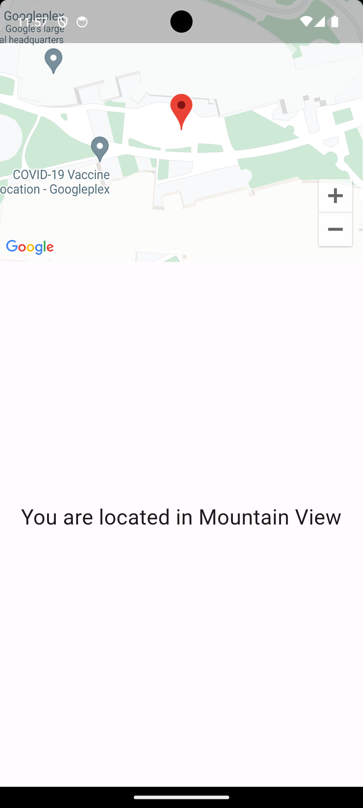

# Flutter GPS Task App

This Flutter app demonstrates how to use the Google Maps plugin to display a map with the user's current location and fetch the city name based on the coordinates.

## Code Overview

The main code is divided into several components:

### `MapScreen`

- The `MapScreen` widget is a `StatefulWidget` that displays the Google Map and the user's city name.
- It utilizes the `GoogleMapViewModel` to load the user's current coordinates and `geocoding` to fetch the city name.
- The UI consists of a Google Map and a text field displaying the user's city name.
- The user's location is marked on the map, and tapping the marker opens a dialog displaying the coordinates.

### `GoogleMapViewModel`

- The `GoogleMapViewModel` is responsible for interacting with the Google Maps API and obtaining the user's location.
- It uses the `geolocator` package to check and request location permissions and to get the user's current position.
- The `loadCurrentUserCoordinates` function returns a `LatLng` object with the user's current latitude and longitude.

### `GoogleMapWidget` and `MarkerCoordinatesDialog`

- The `GoogleMapWidget` is a stateless widget that displays the Google Map using the `google_maps_flutter` package.
- It also handles the marker for the user's current location, which can be tapped to show the coordinates in a dialog using the `MarkerCoordinatesDialog` widget.

### `main.dart`

- The main entry point of the app in `main.dart` initializes the app and sets up the MaterialApp.

## Getting Started

1. Clone this repository.
2. Ensure you have Flutter and Dart installed.
3. Run `flutter pub get` to install the required dependencies.
4. Run the app using `flutter run`.

## Screenshots

Here is a screenshot of the app in action:

## Note

- Make sure to add your Google Maps API key to your Flutter project if you plan to use this app on a real device or release it.

## Contributing

Feel free to contribute to this project by opening issues or creating pull requests.

## License

This project is licensed under the MIT License - see the [LICENSE](LICENSE) file for details.
